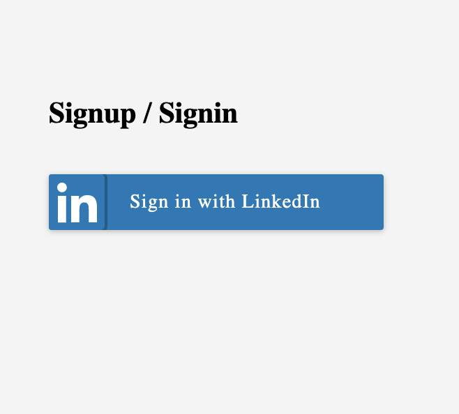

# Authentication  Web Client

> Work in progress - Simple web-client for communication with gRPC authentication microservice written in Go.

- **<a href="https://dev.rami.im/mxweb/index/)**
" target="_blank">Web Client</a>**

- **<a href="https://github.com/rumsrami/grpc-token-service)**
" target="_blank">gRPC Service</a>**

## How it works

1. Client redirects the browser to LinkedIn's OAuth 2.0 authorization page where the member authenticates.
2. After authentication, LinkedIn's authorization server passes an authorization code back to the client.
3. Client sends this code to LinkedIn and LinkedIn returns an access token.
4. Client sends this token to the gRPC authentication microservice
5. Service saves this token & creates another one and sends it back to the client.
6. Client uses new token to communicate with other services

## Objectives
1. Learn how oauth2 works with different providers and Go.
2. Learn how to integrate the below technologies in one unit.

* Docker multistage builds, Go binaries in Scratch images.
* TLS communication between client and oauth2 provider.
* Google Key management service
* Google Container Registry
* Google Compute Engine
* CI/CD with Github, Docker, Google Cloud Build
* Encryption with Google Keys

## License

- **[MIT license](http://opensource.org/licenses/mit-license.php)**
